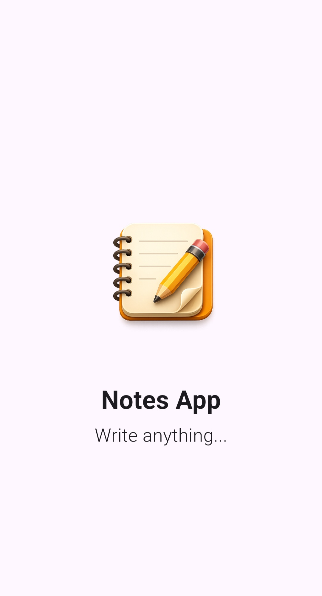
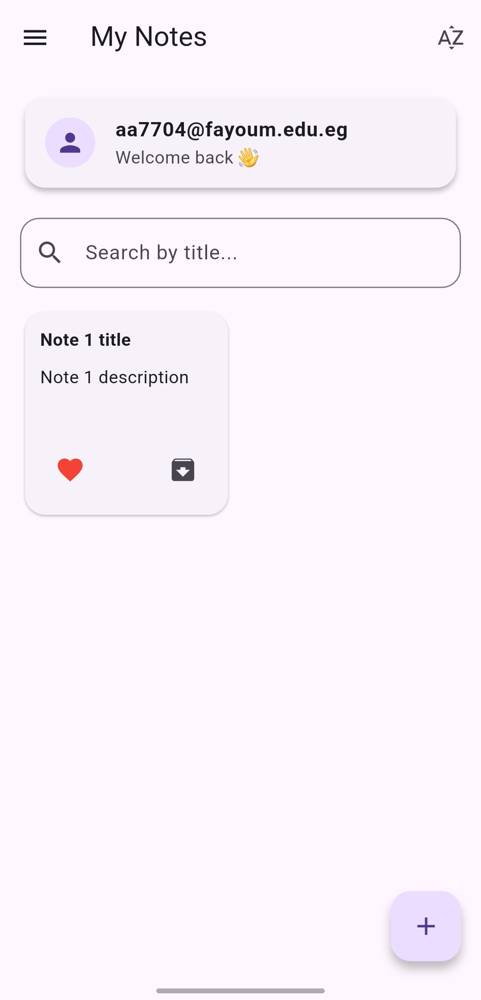
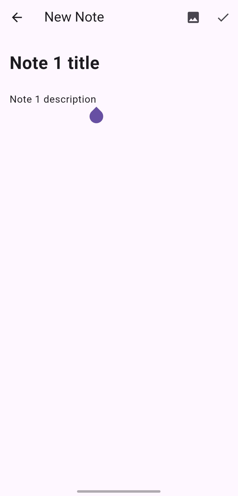
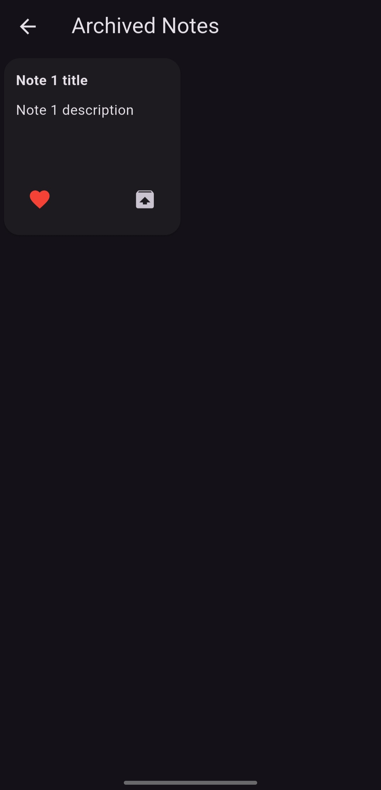
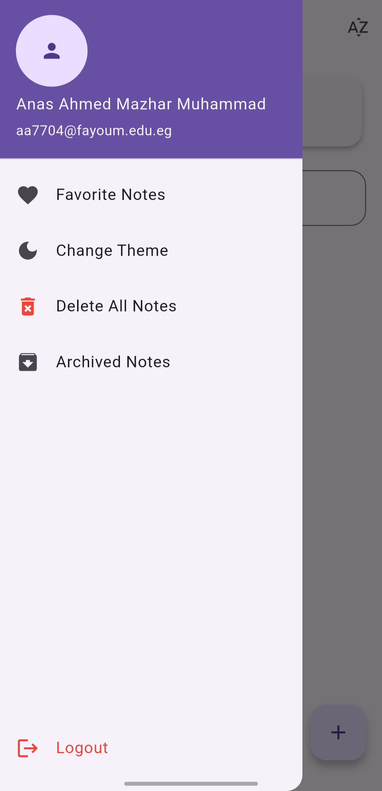

# 📝 Notes App

A modern notes application built with **Flutter** and **Firebase**. The app allows users to create, manage, and organize their personal notes through a clean and user-friendly interface.

## ✨ Features

* 🔐 User Authentication
* 📝 Create, read, update, and delete notes
* ❤️ Add notes to Favorites
* 📌 Pin important notes
* 📦 Archive notes
* 🔔 Local notifications and note reminders
* 🌙 Dark and Light Theme
* ☁️ Cloud storage using Firebase Firestore

## 🛠️ Technologies Used

* Flutter & Dart
* Firebase Authentication
* Cloud Firestore
* Cubit / Flutter Bloc
* GetIt for Dependency Injection
* Flutter Local Notifications
* Feature-Based Architecture

## 🏗️ Project Structure

The project follows a **Feature-Based Architecture**, where each feature contains its own screens, widgets, state management, models, and services.

```text
lib/
├── core/
├── auth/
├── notes/
└── main.dart
```

## 📱 Screenshots

<p align="center">
  
  
  
</p>

<p align="center">
  
  
  
</p>

## 👨‍💻 Author

**Anas Ahmed Mazhar**
Flutter Developer
